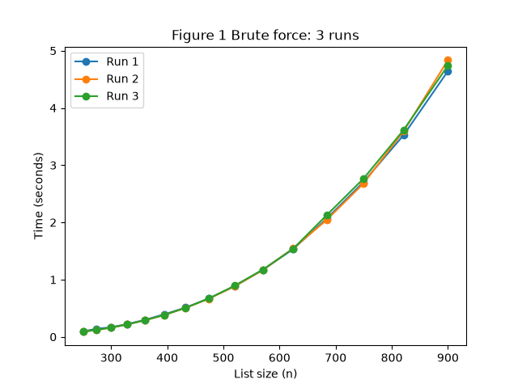
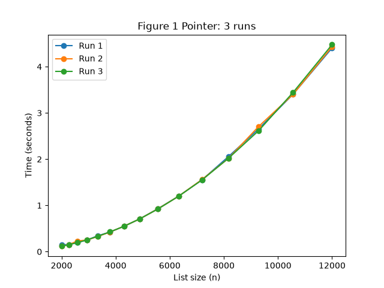
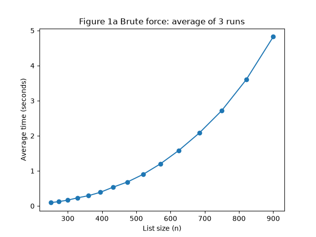
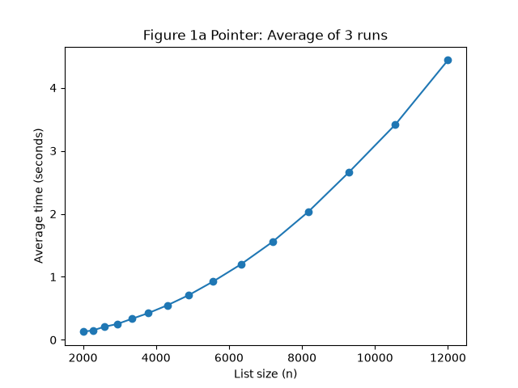

# 1DV018 - Assignment 1 Report

## Part 1 - Three sum Algorithms
### 1. How I conducted the experiments
In my experiments I used `generate_list(n)` to generate random integers to be used. I tested correctness by comparing `threesum_brute` and `threesum_pointer` on three separate randomly generated lists of size 15, generated using the same generate_list funcion. For each list, I compared the two algorithms output and confirmed that they produced identical results.

To find a suitable range of input list sizes for the two algorithms I experimented manually with different inputs of n, timing each algorithm once to locate a range where execution time fell roughly between 0.1 and 5 seconds. Based on this, I chose n = 250-900 for `threesum_brute`and n = 2000-12000 for `threesum_pointer`.

Using these ranges, I generated 15 input sizes per algorithm with my `logspace_sizes` function, which spread sizes evenly on a logarithmic scale rather than linearly. This is because execution time grows polynomially with n - a linear spacing would leave very few data points at small n (where timing differences are hard to see) and too many redundant points at large n.  

For each of the 15 sizes, I ran the algorithm three times using my `run_experiment` function and recorded the execution time for each run. This allowed me to check whether timings fluctuated between repeated runs of the same size.

To avoid duplicating code between the brute force and pointer experiments, I designed functions such as `run_expreiment`and `estimate_complexity`to accept the algorithm itself as a parameter (e.g. `run_experiment(sizes, threesum_brute)`). This meant the same experiment code could be reused for both algorithms without rewriting it. I also separated the code into two files: `threesum.py`, containing only the algorithm implementations, and `experiment1.py`, containing the experiment, timing, and plotting logic.

### 2. Results and comparison

**Figure 1 - three runs per algorithm**

For both algorithms, the three runs produced nearly identical timing curves, with only minor variation between runs. This is expected since `time.perf_counter()` measures elapsed wall-clock time with high precision, and both algorithms are deterministic in terms of the number of operations they perform. The specific integer value in the list does not affect the runtime, only the lists size does. This low variance also suggests that the measurements are reliable enough to average and use for further experiments. 

**Figure 1a - average of three runs**

### 3. Mathematical derivation

### 4. How the pointer approach works