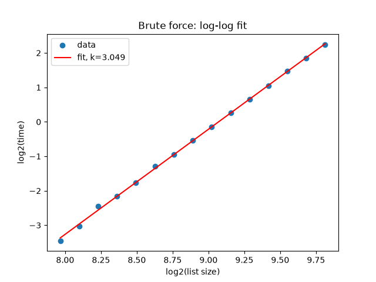
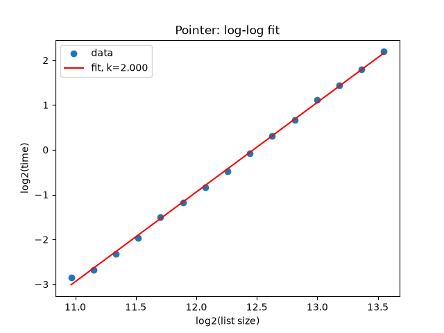

# 1DV018 - Assignment 1 Report

## Part 1 - Three sum Algorithms
### 1. How I conducted the experiments
In my experiments I used `generate_list(n)` to generate random integers to be used. I tested correctness by comparing `threesum_brute` and `threesum_pointer` on three separate randomly generated lists of size 15, generated using the same generate_list funcion. For each list, I compared the two algorithms output and confirmed that they produced identical results.

To find a suitable range of input list sizes for the two algorithms I experimented manually with different inputs of n, timing each algorithm once to locate a range where execution time fell roughly between 0.1 and 5 seconds. Based on this, I chose n = 250-900 for `threesum_brute`and n = 2000-12000 for `threesum_pointer`.

Using these ranges, I generated 15 input sizes per algorithm with my `logspace_sizes` function, which spread sizes evenly on a logarithmic scale rather than linearly. This is because execution time grows polynomially with n - a linear spacing would leave very few data points at small n (where timing differences are hard to see) and too many redundant points at large n.  

For each of the 15 sizes, I ran the algorithm three times using my `run_experiment` function and recorded the execution time for each run. This allowed me to check whether timings fluctuated between repeated runs of the same size.

To avoid duplicating code between the brute force and pointer experiments, I designed functions such as `run_expreiment`and `estimate_complexity`to accept the algorithm itself as a parameter (e.g. `run_experiment(sizes, threesum_brute)`). This meant the same experiment code could be reused for both algorithms without rewriting it. I also separated the code into two files: `threesum.py`, containing only the algorithm implementations, and `experiment1.py`, containing the experiment, timing, and plotting logic.

### 2. Results and comparison

**Figure 1 - three runs per algorithm**

For both algorithms, the three runs produced nearly identical timing curves, with only minor variation between runs. This is expected since `time.perf_counter()` measures elapsed wall-clock time with high precision, and both algorithms are deterministic in terms of the number of operations they perform. The specific integer value in the list does not affect the runtime, only the lists size does. This low variance also suggests that the measurements are reliable enough to average and use for further experiments. 

**Figure 1a - average of three runs**

Both curves show clear upward-curving (non-linear) gorwth, consistent with the expected time complexity of both algorithms.
However, the pointer curve grows noticeably less steeply relative to its own list sizes than the brute force curve does. This is a visual hint that the pointer has a lower time complexity than brute force does, before even performing the log-log analysis in the next section. 

**Comparing brute force and pointer**

The practical difference in performance is substantial. Brute force takes approximately 4.6-4.8 seconds for a list size of n=900, while pointer takes about 4.5-4.7 seconds for a list size of n=12000 (over 13 times larger). Thus demonstrates the importance of algoritmic complexity, at roughly the same computation time the pointer approach can handle dramatically larger input.

### 3. Mathematical derivation

To estimate the time complexity of each algorithm, I used a log-log linear regression approach as stated in the assginment. If execution time follows `time ≈ C · n^k`, taking the logarithm of both sides gives:

 `log(time) = log(C) + k · log(n)`

This is a linear equation of the form y = m + k·x, where x = log(n) and y = log(time). This means that if the algorithms complexity really is O(n^k), plotting log(time) against log(n) should produce points that fall close to a straight line, with the lines slope equal to k. 

I implemented `lin_reg(x, y)` using the ordinary least squares method. Applying this to the logw-transofrmed size and average-time data gave the following resuls:

- Brute force: k = 3.052
- Pointer: k = 2.025

Both plots show the data points closely following the fitted straight line, supporting the validity of the log-log approach. Measured k-values are very close to the theoretical complexies: k ≈ 3 for threesum_brute (three nested loops, O(n³)) and k ≈ 2 for the threesum_pointer (two pointers scanning a sorted list, O(n²))

### 4. How the pointer approach works

The pointer approach solves the 3-sum problem in O(n²) instead of O(n³) by exploiting the a sorted list gives information about which direction to search in.

**Sorting first**

The algorithm begins by sorting a copy of the input list using `sorted(lst)`, which creates a new list and leaves the original unchanged. Sorting is essential to the method: in a sorted list, moving right always means lartger values and moving left always means smaller values. Without this property, the algorithm would have no way of knowing how to adjust the search. 

**Fixing one value and searching for a pair**

The outer loop fixes one element, `lst[i]`, and the problem is then reduced to a 2-sum problem (finding two values in the remaining part of the list that together with `lst[i]` sum to the target)

**The two pointers**

Two pointers are placed at each end of the remaining part of the list, `left` just after `i` and `right` at the end. The sum of the three values is compared to the target.

- If the sum ewuals the target, a valid triplet is found. It is then stores, and both pointers move inward to continue searching.
- If the sum is too small, `left` moves right, which increases the sum.
- If the sum is too large, `right`moves left, which decreases the sum. 

The pointers keep moving toward each other until they meet, at which point all possible pairs for that value of `i` have been considered. 

**Why this gives O(n²)**

The outer loop runs approximately n times. For each iteration, the two pointers together traverse the remaining part of the list at most once, since each step moves one pointer permanently closer to the other. This makes the inner search O(n), giving a total complexity of O(n) x O(n) = O(n²), compared to the three nested loops of the brute force version.

**Handling uniqueness**

Because the list is sorted and the indices alweays satisfy i < left < right, each triplet is produced in ascending order automatically. Unlike the brute force version, no additional sorting of the triplet is required before storing it. A `set`is still used to guarantee that duplicate triplets (which can occur when the input contains repeated values) appear only once in the result.